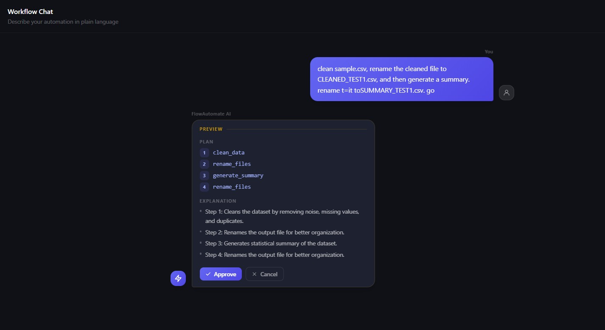
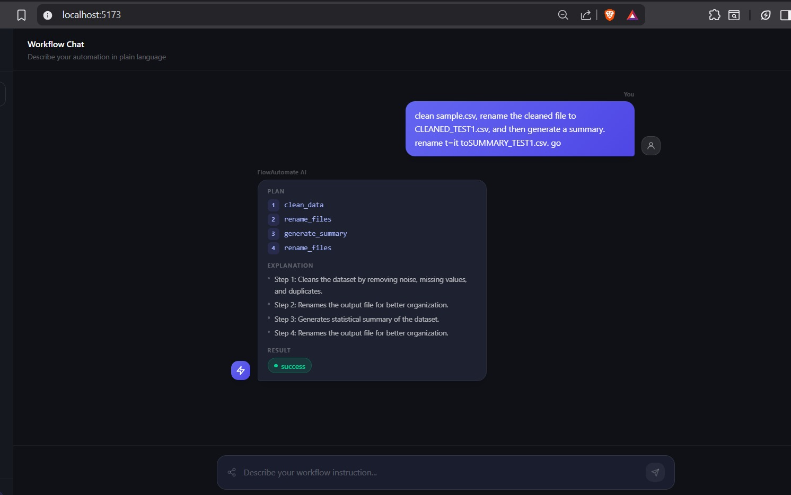
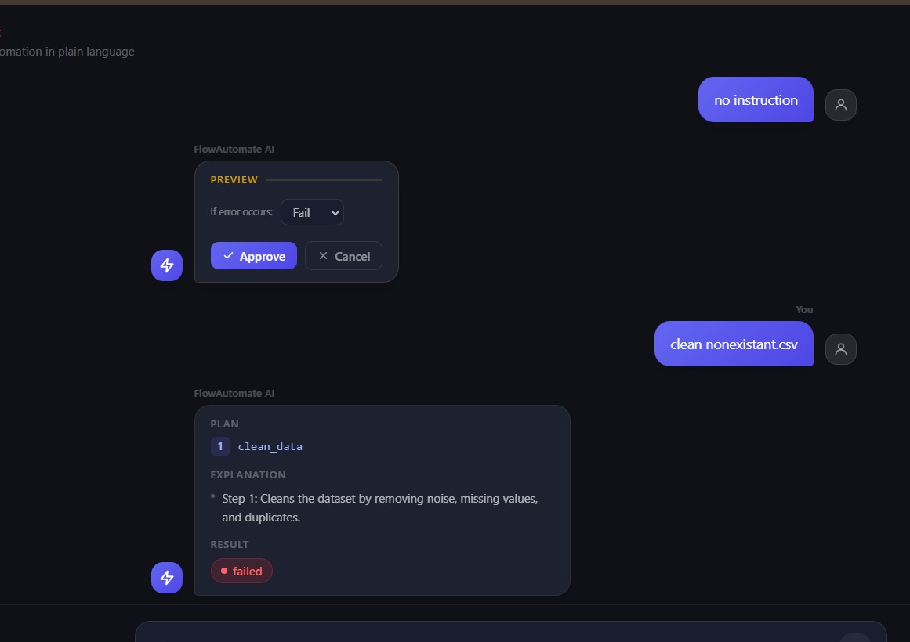

# FlowAutomate AI

LLM-powered workflow orchestration system that converts natural language instructions into executable workflows using predefined tools.

# FlowAutomate AI

> Convert natural language instructions into executable file-management workflows.

FlowAutomate AI is an LLM-powered workflow automation system that transforms plain-English requests into structured workflows, explains the generated plan, allows user approval, and executes file operations automatically.

Instead of writing custom scripts for repetitive tasks, users can simply describe what they want, and FlowAutomate handles planning, validation, and execution.

---

## Demo

### Workflow Preview



### Workflow Execution



### Error Handling



---

## Example

### User Request

```text
Clean sample.csv, rename the cleaned file to CLEANED_TEST1.csv,
generate a summary, and rename the summary file.
```

### Generated Workflow

```text
1. clean_data
2. rename_files
3. generate_summary
4. rename_files
```

### Result

```text
✓ Dataset cleaned
✓ File renamed
✓ Summary generated
✓ Workflow completed successfully
```

---

## Key Features

- Natural language → workflow generation
- Workflow preview before execution
- User approval / cancellation flow
- Explainable workflow reasoning
- Multi-step workflow execution
- Execution-state propagation between steps
- Configurable error handling (Fail / Retry / Skip)
- Execution logging
- Interactive React frontend
- FastAPI backend APIs

---

## Architecture

```text
User Prompt
      │
      ▼
LLM Planner
      │
      ▼
Parser & Validator
      │
      ▼
Workflow Preview
      │
      ▼
User Approval
      │
      ▼
Execution Engine
      │
      ▼
Logs + Results
```

---

## Tech Stack

### Backend

- Python
- FastAPI
- Pandas

### Frontend

- React
- Vite
- Tailwind CSS

### AI

- Groq API
- Llama 3.1 8B Instant

---

## What Makes This Different?

Most LLM applications stop at generating instructions.

FlowAutomate goes a step further by:

- generating executable workflows
- validating LLM output before execution
- maintaining workflow state across steps
- executing real file operations
- providing explainability and user approval before execution

This bridges the gap between **understanding a task** and **actually performing it**.

---

## Current Capabilities

- Dataset cleaning
- File renaming
- Dataset summarization
- Workflow validation
- Explainability layer
- Workflow approval system
- Error-handling configuration

---

## Future Improvements

- Additional automation tools
- Parallel workflow execution
- Workflow persistence
- Drag-and-drop workflow builder
- Docker deployment

---

## Author

**Sanjana Chitthoor**
